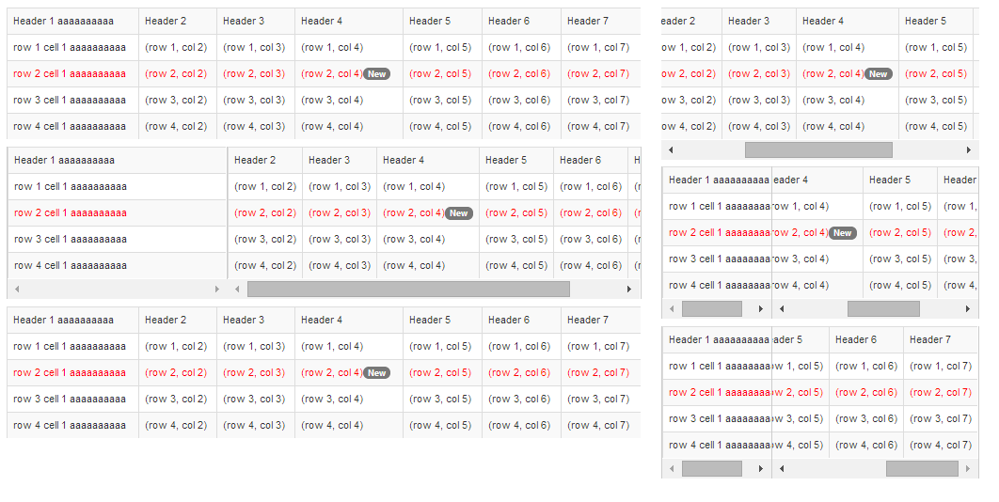

# [tableResponsive](https://github.com/eddyystop/mithril-components/tree/master/components/tableResponsive)

responsiveTable renders tables which may scroll horizontally.
Optional pinned columns are always displayed.

The table width and other properties are defined in the CSS, so web designers may control the styling.
tableresponsive may be used in responsive designs as the table width reacts to CSS media query changes.

##### Alternatives

If you don't need pinned columns, consider
[table](../table)
perhaps wrapping it in a vertically or horizontally scrolling div.

If the table has many rows, 
or if you want to scroll the table both horizontally and vertically,
consider [occlusionTable](../occlusionTable).


## Sample usage
#### Results (shown at 2 CSS media query breakpoints)


#### Run it
Point browser at /mithril-components/public/tableResponsive.html .

#### Code
```
<link href="vendor/bootstrap/css/bootstrap.css" rel="stylesheet" type="text/css">
<link href="../components/tableResponsive/occlusionTable.css" rel="stylesheet" type="text/css">

<style>
#table0, #table1, #table2 {
  width: 900px !important;
}
@media all and (max-width: 800px) {
  #table0, #table1, #table2  {
    width: 650px !important;
  }
}
@media all and (max-width: 700px) {
  #table0, #table1, #table2 {
    width: 450px !important;
  }
}
</style>

<script src="js/vendor/mithril.js"></script>
<script src="js/vendor/jquery.js"></script> <!-- not a dependency for component -->
<script src="../components/utils/mcUtils.js"></script>
<script src="../components/tableResponsive/tableResponsive.js"></script>

$(window).on('resize', function () {
    m.startComputation();
    m.endComputation();
});

var app = {
    controller: function () {
      var table = [
        ['Header 1 aaaaaaaaaa', 'Header 2', 'Header 3', 'Header 4', 'Header 5', 'Header 6', 'Header 7'],
        ['row 1 cell 1 aaaaaaaaaa', '(row 1, col 2)', '(row 1, col 3)', '(row 1, col 4)', '(row 1, col 5)', '(row 1, col 6)', '(row 1, col 7)'],
        ['row 2 cell 1 aaaaaaaaaa', '(row 2, col 2)', '(row 2, col 3)', 'xxxxxxxxxxxxxx', '(row 2, col 5)', '(row 2, col 6)', '(row 2, col 7)'],
        ['row 3 cell 1 aaaaaaaaaa', '(row 3, col 2)', '(row 3, col 3)', '(row 3, col 4)', '(row 3, col 5)', '(row 3, col 6)', '(row 3, col 7)'],
        ['row 4 cell 1 aaaaaaaaaa', '(row 4, col 2)', '(row 4, col 3)', '(row 4, col 4)', '(row 4, col 5)', '(row 4, col 6)', '(row 4, col 7)']
      ];
      table[2][3] = [m('span','(row 2, col 4)'), m('span.badge', 'New')];
    
      this.table0 = new mc.TableResponsive.controller(table);
      this.table1 = new mc.TableResponsive.controller(table);
      this.table2 = new mc.TableResponsive.controller(table);
    },
    
    view: function (ctrl) {
      var attrs2 = {
        '2': {style: {color: 'red'}}
      };
    
      return m('.container', [
        m('p'),
        // a plain table
        mc.TableResponsive.view(ctrl.table0, {
          selectors: {wrapper: '#table0', parent: '.table .table-bordered .table-striped .table-bordered'},
          attrs: attrs2
        }),
        m('p'),
        // a pinned table
        mc.TableResponsive.view(ctrl.table1, {
          isPlain: false,
          selectors: {wrapper: '#table1', parent: '.table .table-bordered .table-striped .table-bordered'},
          attrs: attrs2
        }),
        m('p'),
        // a table responsive to media width
        mc.TableResponsive.view(ctrl.table2, {
          isPlain: function () { return $(window).width() >= 760; },
          selectors: {wrapper: '#table2', parent: '.table .table-bordered .table-striped .table-bordered'},
          attrs: attrs2
        })
      ]);
    }
};

m.module(document.body, app);
```

## Controller
```
controller: function () {
  this.table = m.prop([ [...], [...], ... ]);
  this.component = new mc.tableResponsive.controller(table)
}
```

* `table {fcn | array of arrays}` 
The table to display. 
It is or returns an array of rows, each row containing column cells.
The number of columns in the table is taken from the first row.
    * `cell {str | numb | fcn | m() | array of m()}` the cell value.
    A fcn is called.


## View
```
view: function (ctrl) {
  return mc.tableResponsive.view(ctrl, options);
}
```

* `ctrl {obj}` is the controller.
* `options {obj}` contains the following optional properties:
    * `isPlain {boolean | fcn | null defaults true}` is a normal table is to be rendered.
    A table with pinned columns will be rendered is false.
    A fcn is called and a {bool} is expected as a result.
    * `startRow {numb | default 0 }` the starting row to display (base 0).
    * `rows {numb | defaults to last row }` number of rows to display.
    * `pinnedCols {numb | default 1 }` the number of leading columns to pin (base 1).
    * `selectors {obj}` are the Mithril selectors attached to various elements in the table.
    * `attrs {obj}` are the Mithril attrs attached to various elements in the table.

`selectors` and `attrs` specify the Mithril selectors and attrs to be attached to 
different locations in the structure, e.g. `parent: '.table .table-bordered .table-striped'`

The locations are:
* `parent` The < table>.
* `tr` Every < tr>.
* `even` Even row < tr>.
* `odd` Odd row < tr>.
* `{number}` The < tr> of that row number (base 0).

## Styling the table with CSS

It is usually preferable to control table width using CSS.
CSS also gives you the flexibility to make the table width responsive to
media width.
Finally CSS is the only way to specify the relative width allocated to the pinned columns.
 
Idiomatic CSS would be:
````
div#table0 {
    width: 750px !important;
}
@media all and (max-width: 800px) {
    div#table0 {
        width: 650px !important;
    }
}
div.mc-clipped-table-pinned div.scrollable {
    margin-left:35%;
}
div.mc-clipped-table-pinned div.pinned {
    width: 35%;
}
````

* The table height and width are specified at 2 media widths.
* The pinned columns are allocated 35% of the table width.

All other styling is in `/components/tableResponsive/occlusionTable.css`.